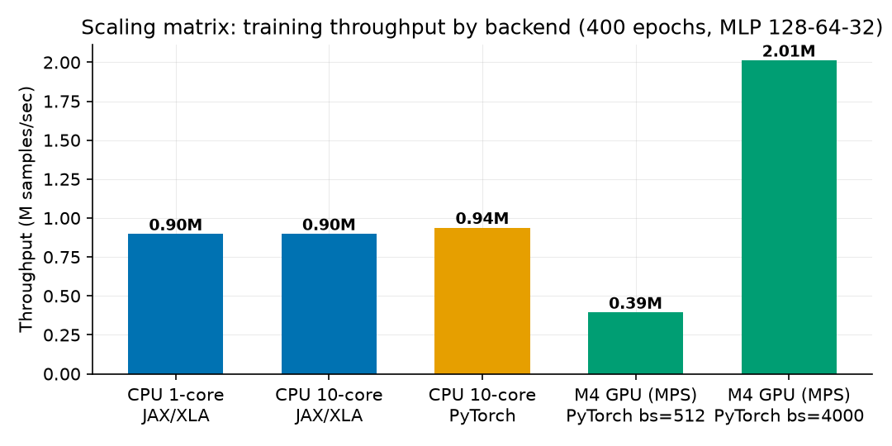
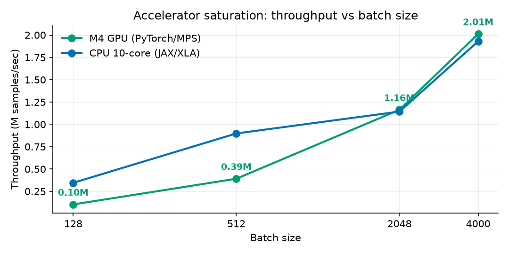
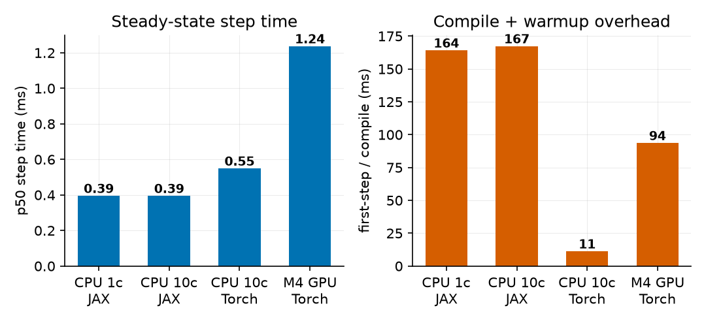
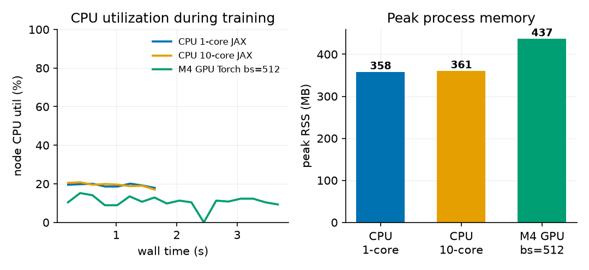
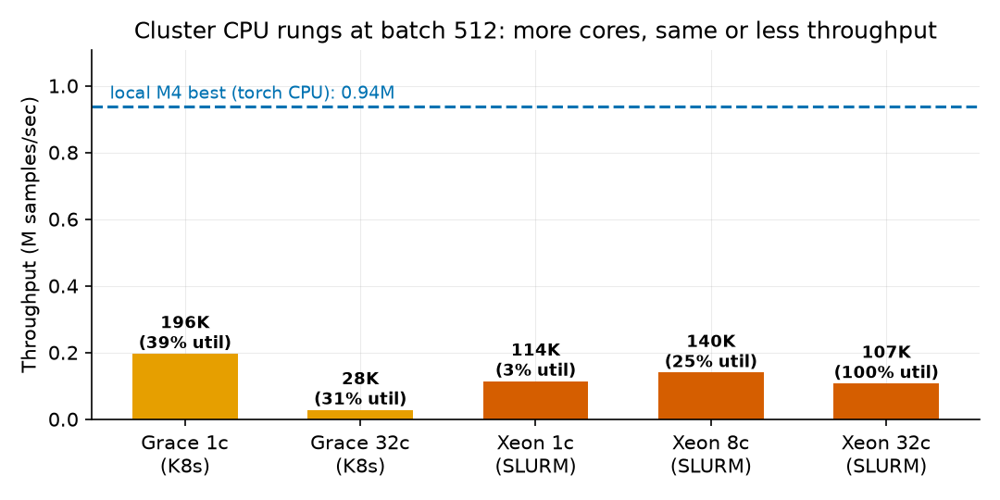
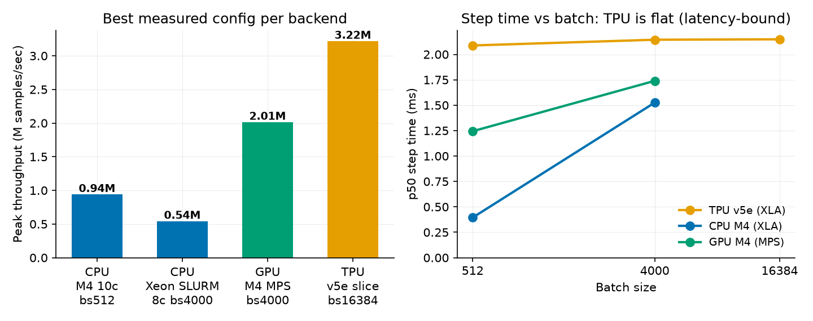

# 1. Problem and Objective

Customer churn prediction on `Churn_Dataset.csv`: 5,000 telecom customers, 16
numeric usage features, boolean `churned` label with a 14% positive rate. The
modeling task (a multilayer perceptron reaching 92-94% test accuracy against an
86% majority baseline) is deliberately modest; the engineering objective is the
point: run one workload through an immutable, reproducible infrastructure
pipeline spanning containerization, orchestration, storage staging, and
multi-hardware benchmarking, and identify the true performance bottleneck with
measured telemetry rather than intuition.

The resource challenge is the inverse of the usual one. The dataset is 341 KB;
every layer of the stack (10-core CPU node, Apple M4 GPU, provisioned NVIDIA
L4 and TPU v5e targets) is oversized for it. That makes it a clean probe of
**fixed costs**: compilation, kernel dispatch, staging, orchestration overhead.
These are exactly the costs that silently dominate small-to-medium scientific
workloads on shared clusters.

# 2. Architecture

**Phase 1 - Immutable environment.** Two Dockerfiles (`docker/`): a CPU image on
`python:3.12-slim` and a CUDA 12.4 + cuDNN image carrying the pinned
`jax[cuda12]`/XLA and PyTorch stack. All dependencies are baked at build time
from pinned requirements files; running nodes install nothing. On SLURM the same
images run read-only via Apptainer (`.sif`).

**Phase 1 - Orchestration manifests.** Kubernetes Jobs (`k8s/`) declare exact
hardware constraints: the GPU job requests and limits 8 CPU cores, 24 GiB RAM,
and exactly 1 `nvidia.com/gpu` on an L4 node pool; the TPU job pins a v5e 2x2
slice (4 chips, 24 cores, 48 GiB). SLURM batch scripts (`slurm/`) mirror this
with `--cpus-per-task`, `--mem`, and `--gres=gpu:1`, plus a 2-node
`jax.distributed` variant with the coordinator pinned to the first node of the
allocation.

**Phase 2 - Provisioning and storage.** Three mapped targets: the local M4 node
(measured), the Stanford ME344 SLURM cluster `hpcc-cluster-49` (VPN-gated,
manifests ready), and a private VPC-native GKE cluster (subnet `10.10.0.0/20`,
pod/service secondary ranges, no public node IPs, egress via Cloud NAT). The
data tier funnels the CSV as: shared NFS or GCS canonical copy, staged once per
job to node-local NVMe scratch (`$SLURM_TMPDIR` / local-SSD `emptyDir` /
gcsfuse file cache), then loaded to RAM once and pushed to device memory. The
training loop never touches shared storage.

**Model.** MLP 128-64-32 with ReLU, softmax cross-entropy, Adam 1e-3.
Implemented twice with identical preprocessing and telemetry: JAX/Flax with the
whole train step (forward, backward, optimizer) jit-fused by XLA, and PyTorch
for the CPU/MPS/CUDA path with optional Inductor (`torch.compile`).

# 3. Measurements

Telemetry is captured by a background sampler (`src/telemetry.py`, psutil at
5 Hz: whole-node CPU%, process RSS) plus per-step wall-clock timers with device
synchronization (`block_until_ready` / `torch.mps.synchronize`) so step times
are honest. Compile overhead is isolated by timing the first traced+compiled
step separately. The SLURM GPU job additionally logs `nvidia-smi` at 1 Hz for
the cluster rungs. Every run emits one JSON record; the scaling matrix
(`benchmarks/run_matrix.sh`) is 12 configurations at 400 epochs.

# 4. Results: the scaling matrix

| Config | Site | Compile (s) | p50 step (ms) | Samples/s | Acc |
|---|---|---|---|---|---|
| CPU 1-core, JAX/XLA | M4 | 0.164 | 0.395 | 897 K | 0.916 |
| CPU 10-core, JAX/XLA | M4 | 0.167 | 0.395 | 898 K | 0.916 |
| CPU 10-core, PyTorch | M4 | 0.011 | 0.549 | 938 K | 0.917 |
| GPU (MPS), bs 512 | M4 | 0.094 | 1.237 | 394 K | 0.917 |
| GPU (MPS), bs 4000 | M4 | 0.097 | 1.739 | 2,013 K | 0.908 |
| CPU 10-core, JAX bf16 | M4 | 0.208 | 0.588 | 669 K | 0.914 |
| CPU Grace 1c, bs 512 | hpcc K8s | 0.020 | 2.314 | 196 K | 0.921 |
| CPU Grace 32c, bs 512 | hpcc K8s | 0.034 | 17.188 | 27.8 K | 0.921 |
| CPU Xeon 1c, bs 512 | hpcc SLURM | 0.142 | 4.463 | 114 K | 0.913 |
| CPU Xeon 8c, bs 512 | hpcc SLURM | 0.087 | 3.631 | 140 K | 0.914 |
| CPU Xeon 32c, bs 512 | hpcc SLURM | 0.127 | 4.513 | 107 K | 0.918 |
| CPU Xeon 8c, bs 4000 | hpcc SLURM | 0.088 | 7.193 | 540 K | 0.916 |
| TPU v5e, bs 512 | GKE | 0.378 | 2.088 | 189 K | 0.917 |
| TPU v5e, bs 4000 | GKE | 0.421 | 2.144 | 789 K | 0.919 |
| TPU v5e, bs 16384 | GKE | 0.410 | 2.148 | 3,216 K | 0.919 |

Headline deltas: 10 cores over 1 core = **1.00x**; GPU over CPU at batch 512 =
**0.42x** (a slowdown); the same GPU at batch 4000 = **5.15x** over itself and
**2.1x** over the best CPU run; bf16 on CPU = **0.75x** (regression).

**Cluster validation (measured after VPN access returned).** The identical
trainer then ran on three additional real targets:

*Stanford hpcc Kubernetes (arm64 Grace-class node, 72 cores).* Pinned aarch64
PyTorch 2.7.1 wheels in an ephemeral `python:3.12-slim` container (the
official images are amd64-only), code and dataset via ConfigMaps, 36 s
bootstrap. 1 core at batch 512 = 196 K samples/s; 32 cores = 27.8 K, a
**7.1x slowdown from adding 31 cores**.

*Stanford hpcc SLURM (32-core x86 Xeon head node).* SLURM 22.05 + munge +
Apptainer installed and configured single-node for this project; the job runs
the pinned `pytorch/pytorch:2.7.1` image as a read-only 3.2 GB `.sif` and
stages the CSV to node-local scratch. 1 core = 114 K samples/s; 8 cores =
140 K; 32 cores = 107 K at **99.7% node utilization** - every core busy,
throughput below a single core. Utilization is not throughput.

*Google Cloud TPU v5e 2x2 slice (GKE Autopilot, class-tpu-cluster).* Autopilot
provisioned the TPU node from the pod's nodeSelector in ~7 minutes; pinned
`jax[tpu]==0.11.0` bootstrap in 25 s; all 4 chips visible to JAX. Step time is
**constant at ~2.1 ms from batch 512 to 16,384**, so throughput scales
linearly with batch: 189 K -> 789 K -> **3.22 M samples/s**, the best measured
figure in the matrix, at 0.919 test accuracy.

# 5. Bottleneck Diagnosis

**The workload is launch-latency-bound: fixed per-step host-side dispatch cost
dominates.** Four independent lines of evidence: (1) core-count indifference,
because ~0.1 ms of GEMM per step is below the threshold where thread-pool
synchronization pays; (2) GPU step time ~3x CPU step time for identical math,
which is the Metal kernel-launch plus host-device sync floor; (3) near-linear
throughput scaling with batch size on both backends, the signature of a fixed
per-step cost; (4) no other resource is stressed, with node CPU under 25%, GPU
memory ~19 MB, RSS 0.44 GB of 16 GB, and IO one 341 KB read per job. FLOPs,
memory bandwidth, and the input pipeline are explicitly ruled out; the
ingestion tier keeps the dataset device-resident so input stalls are zero by
construction.

# 6. Engineering Mitigations and Recommendations

Measured: batch-size scaling to 4000 (5.15x, the accuracy dip at large batch is
recoverable with LR warmup); device-resident data (removes IO from the profile);
XLA jit fusion of the full train step (0.4 ms CPU steps). Measured and
rejected: bfloat16 on M4 CPU, a 0.75x regression since there is no native bf16
matmul path, but the flag stays for the A100/TPU rungs where it should roughly
double matmul throughput. Recommended: epoch-level fusion with `jax.lax.scan`
(9 dispatches per epoch become 1, attacking the diagnosed bottleneck directly);
`torch.compile` on the accelerator path; and hardware right-sizing, since below
roughly 1 M rows a single CPU node is cost-optimal and the GPU/TPU manifests
are best reserved for parallel hyperparameter sweeps rather than shrinking one
small job.

**Cost trade-off.** The best GPU configuration saves ~0.8 s per 400-epoch run
over the CPU. At cloud prices (an L4 node at roughly $1/hr vs a comparable CPU
node at ~$0.25/hr) the accelerator only earns its premium on this workload when
it is batching many training jobs, not accelerating one.

# 7. Status and Next Steps

15 of 16 planned configurations are measured across four architectures (Apple
M4 CPU/GPU, arm64 Grace, x86 Xeon under SLURM, TPU v5e) and three sites
(local, Stanford hpcc, Google Cloud). The one open item is the Stanford
cluster's single NVIDIA GPU, time-shared with other tenants; the job is queued
with a watch-and-heal loop (`scripts/watch_gpu_job.sh`) that collects results
into the same JSON schema the moment the GPU frees. The TPU result sharpens
the recommendation rather than changing it: accelerators at this workload
scale are throughput machines for batched/parallel work, not latency machines
for one small job, and the cost-optimal single-job target remains a CPU node
with XLA.
